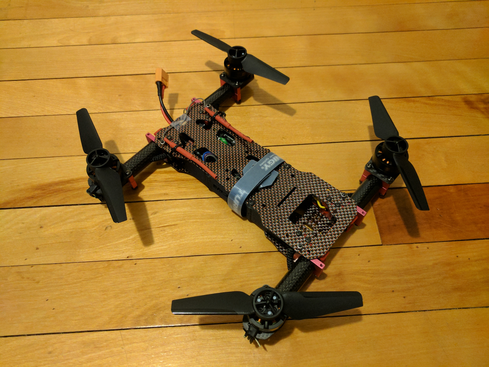
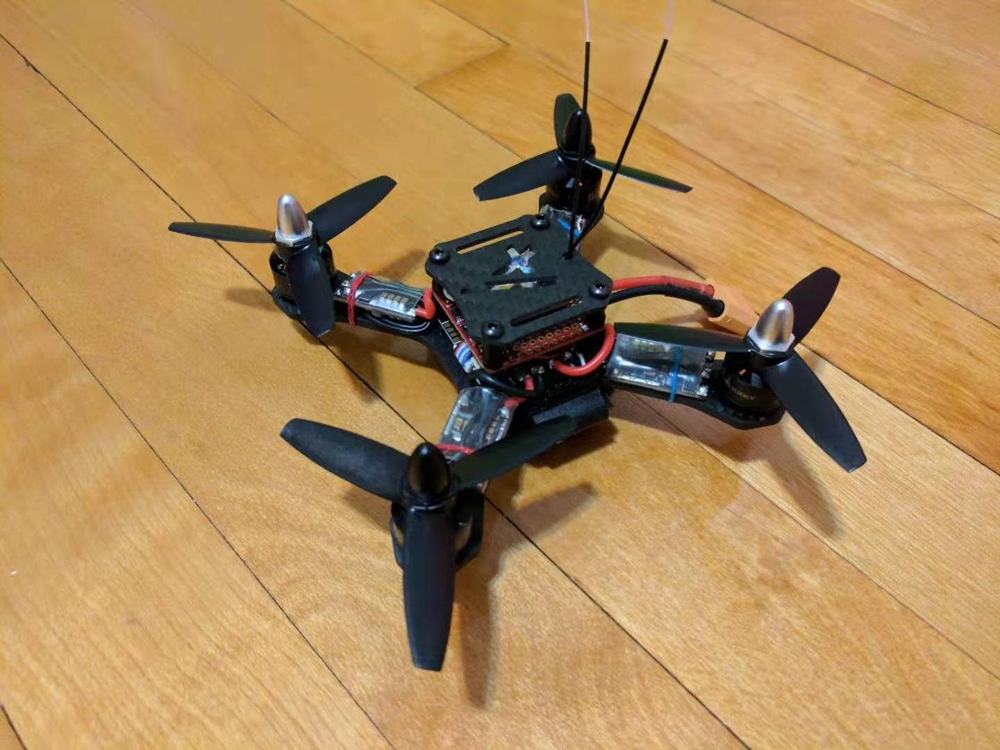

(Updated on 01/04/2017)

Here is a summary of how I built my quadrotors. The primary use of these quadrotors includes: flying for fun, autonomous flight for research. You may find configurations specialized for other purposes somewhere else from the Internet.

#### Hardware Components

- Flight controller * 1
- (Companion computer * 1)
- 250 frame * 1
- DC brushless motors * 4
- ESC for brushless motors * 4
- Power distribution and BEC * 1
- LiPo Battery (3S or 4S)
- Radio receiver and remote controller

There are a lot of possible choices for flight controllers nowadays. I personally own OpenPilot Revolution, Pixracer and BrainFPV RE1. All these boards are based on STM32F4 MCUs and have reasonably rich hardware interfaces exposed, which allows you to add more extension modules. The main advantages of Pixracer and the PX4 software stack are its large user community and support for a large number of peripheral modules. But the downside is that the software packages (including firmware, GCS, ROS etc.) have become very large and can be confusing sometimes for you to fully understand (especially if you may also come across packages from the APM project). The code base for the OpenPilot-rooted project (librepilot, taulabs, dRonin) is relatively smaller and cleaner. The design of GCS is also very intuitive and user-friendly.

You also have a lot of choices for motors and ESCs from websites like Hobbyking and getFPV. I recently tried the DJI snail propulsion system. I have to say that I love this set of motors/ESCs. They are well-made, very powerful and well documented (for those who want to know better about the characteristics of the motors and propellers). And the price is very reasonable for its quality.

#### Software Structure

**Low level flight controller**

* Acquire sensor data (IMU)
* Flight attitude/position control
* Motor control
* Telemetry

**High level controller**

* Computer vision
* Motion planning

**Workstation**

* System monitoring
* Debugging

#### The Completed Quadrotor

(Updated on 01/23/2016)

I finally get enough time and money to get all parts to build a complete quadrotor (as shown in the image at the top of this post). I choose the CC3D Revolution flight controller since it has a very small foot print and uses similar chips as what I've partially tested before. All parts are selected according to the specifications of commonly seen FPV racing quadrotors. I did a lot of research to find a balance between the performance and my budget when choosing each component. The total cost of the quadrotor and necessary accessories is about $500 dollars.

The second build is improved in the following aspects:

* Better quality frame: [Moka Delux](http://mokaframe.com) vs [Kim250 Pro](https://hobbyking.com/en_us/kim250-pro-fpv-multrotor-with-pcb.html)
* Better motor/ESC: "DJI Snail Racing Propulsion System" vs "Multistar Elite 2306-2150KV 'MINI MONSTER' + Afro Race Spec Mini 20Amp"
* Better wire management

(It's generally recommended to put the two antenas at 90 degrees. But I hadn't found a good way to mount them in such configuration when I took this photo.)

(Updated on 10/02/2017)

More quadrotors (size 250, 150, 130, 90mm) in the picture.

The 150mm quadrotor is based on a Diatone Tyrant system and I only swapped the flight controller. The 90mm one is a Crazyflie 2.0. The custom-build 90mm size quad is my favorite build which in my opinion gives the best balance between size and payload for personal use. Nowadays it's not as easy to find a place that can freely fly the quadrotors outdoor and it's very challenging to fly big ones indoor. However, if you need to put a lot of sensors and more powerful on your quadrotor for research, it's probably better to go with a much bigger frame.

